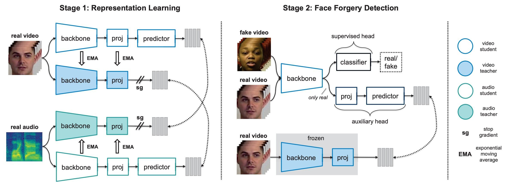

# RealForensics

## Introduction
We provide code for the reproduction of the main results in [Leveraging Real Talking Faces via Self-Supervision for Robust Forgery Detection](https://arxiv.org/abs/2201.07131). Our implementation is based on 
[PyTorch Lightning](https://www.pytorchlightning.ai/). 

## Preparation
### Installation
`conda env create -f environment.yml`. Change the environment prefix to match the location of miniconda3, if necessary.

### Data
1. The datasets we use in the paper can be downloaded from the links below.
    * [LRW](https://www.robots.ox.ac.uk/~vgg/data/lip_reading/lrw1.html)
    * [FaceForensics++ / FaceShifter](https://github.com/ondyari/FaceForensics)
    * [DeeperForensics](https://github.com/EndlessSora/DeeperForensics-1.0)
    * [CelebDF-v2](https://github.com/yuezunli/celeb-deepfakeforensics)
    * [DFDC](https://ai.facebook.com/datasets/dfdc/) (the list of videos we use can be found in `data/DFDC/dfdc_vids.txt`)
2. Place the videos in the corresponding directories.
    * For example, FaceForensics++, FaceShifter, and DeeperForensics: `data/Forensics/{type}/c23/videos`, where `type` is
    one of the following: Real, Deepfakes, FaceSwap, Face2Face, NeuralTextures, FaceShifter, DeeperForensics.
    * The csv files provided for each dataset (e.g., in `data/Forensics/csv_files`) show the expected naming of the files.
3. Place the facial landmarks in the corresponding folders as .npy files: same directory as above but replace `videos` with `landmarks`. 
Each landmark file should have the same name as its corresponding video (except that it ends in .npy).
    * The 68 landmarks can be computed e.g., using [RetinaFace](https://github.com/biubug6/Pytorch_Retinaface) and 
    [2-D FAN](https://github.com/1adrianb/face-alignment).
4. Use the following command to crop faces. The cropped faces will be placed at a similar path as above: 
`data/Forensics/{type}/c23/cropped_faces`. For example, to crop the real faces from FaceForensics++, run
    ```
    python preprocessing/extract_faces.py --root-dir ./data/Forensics/Deepfakes/c23
    ``` 

## Stage 1: Representation Learning
The code for stage 1 of our method can be found in the directory `stage1`. To train the model with the default arguments, run
```
python stage1/train.py experiment_name=stage1_csn_150epochs batch_size=256
```
**Notes:**
* We use [hydra](https://hydra.cc/docs/intro/) for configuration management. You can have a look in the directory `stage1/conf` for all hyperparameter options.
* We use [Weights and Biases](https://wandb.ai/site) for logging. Please 
follow the link to create a free account, if not done so already.
* We use DDP to train on 8 GPUs. We have not tested the code on a single GPU. By default,
the code will use all GPUs on the current node for training. To use a subset of the GPUs, you can prepend e.g., CUDA_VISIBLE_DEVICES=0,1
to the above command.
* To monitor the training (to ensure that e.g., no representation collapse has occurred), we use a "prober" (a.k.a. a 
stop-gradient classifier). This prober is a lightweight 1-layer transformer that takes as input the representations and 
classifies them into the 500 classes provided by LRW. *Critically, no gradient is passed back to the backbone and thus this 
prober does not affect representation learning in any way*.

## Stage 2: Face Forgery Detection

### Evaluate
We provide pretrained models for reproduction of the main results.
#### Cross-manipulation generalisation
1. Download the models trained on (1) [all types but Deepfakes](https://drive.google.com/file/d/1XPQGdBXIDLaUXtdzVKoPVUFTmuisZiBM/view?usp=sharing),
(2) [all types but FaceSwap](https://drive.google.com/file/d/1VcPYb8UVHBJD10UXhLwH5tyTq1RSFyYU/view?usp=sharing),
(3) [all types but Face2Face](https://drive.google.com/file/d/1vDo_aUgGypx3bGGnW1nDMWKRiJjwrTOt/view?usp=sharing), and 
(4) [all types but NeuralTextures](https://drive.google.com/file/d/1qWGRM6aw9lp8YhOQ3FKoN_uWNazygyMy/view?usp=sharing).
Place them in `stage2/weights`. The video-level AUC results from Table 1 of the main text are reproduced below.

    Deepfakes | FaceSwap | Face2Face | NeuralTextures
    :------------: | :-------------: | :-------------: | :-------------:
    100.% | 97.1% | 99.7% | 99.2%
    
2. To evaluate using e.g., the model trained on all types but Deepfakes, run
    ```
    python stage2/eval.py model.weights_filename=realforensics_allbutdf.pth
    ```
#### Cross-dataset generalisation
1. Download the [pretrained model](https://drive.google.com/file/d/1nqEVlRN51WyzMWSeB7x9okcaegFgA-BQ/view?usp=sharing) 
and place into `stage2/weights`. The video-level AUC results from Table 2 of the main text are reproduced below.
    
    CelebDF-v2 | DFDC | FaceShifter | DeeperForensics
    :------------: | :-------------: | :-------------: | :-------------:
    86.9% | 75.9% | 99.7% | 99.3%
2. To evaluate on all datasets, run
    ```
    python stage2/eval.py model.weights_filename=realforensics_ff.pth
    ```

#### Robustness
1. Download the [model](https://drive.google.com/file/d/1EGcHXbRCh2_3Sj0VJi2pseoGE2FiM7BJ/view?usp=sharing) 
trained without augmentations on FF++ and place it in `stage2/weights`. The video-level AUC 
results from Table 4 of the main text are reproduced below.

    Saturation| Contrast | Block | Noise | Blur | Pixel | Compress
    :------------: | :-------------: | :-------------: | :-------------: | :-------------: | :-------------: | :-------------:
    99.8% | 99.6% | 98.9% | 79.7% | 95.3% | 98.4% | 97.6%
    
2. Use the [DeeperForensics code](https://github.com/EndlessSora/DeeperForensics-1.0/tree/master/perturbation) to apply
the perturbations to the raw version of FF++, preprocess them as described above, and then place them at the same path 
as the c23 version of FF++, except replace `c23` with a name describing the perturbation, e.g., `vc_3` for video compression
at severity 3. For example, FF++ real samples corrupted with compression at severity 3 should be placed in 
`data/Forensics/Real/vc_3/cropped_faces`.
3. To evaluate on e.g., Gaussian blur with severity 4, run
    ```
    python stage2/eval.py model.weights_filename=realforensics_ff_nomasking.pth data.dataset_df.ds_type=gb_4
    ```
### Train
1. To train on face forgery detection (stage 2 of RealForensics), place the model 
trained on LRW (from stage 1) to `stage2/weights`.
2. Then, to use the default hyperparameters, run
    ```
    python stage2/train.py experiment_name=stage2_csn_150epochs batch_size=32 model.weights_filename=lrw_stage1_learning.pth
    ```

## Citation
If you find this repo useful for your research, please consider citing the following:
```bibtex
@inproceedings{haliassos2022leveraging,
  title={Leveraging Real Talking Faces via Self-Supervision for Robust Forgery Detection},
  author={Haliassos, Alexandros and Mira, Rodrigo and Petridis, Stavros and Pantic, Maja},
  booktitle={Proceedings of the IEEE/CVF Conference on Computer Vision and Pattern Recognition},
  pages={14950--14962},
  year={2022}
}
```